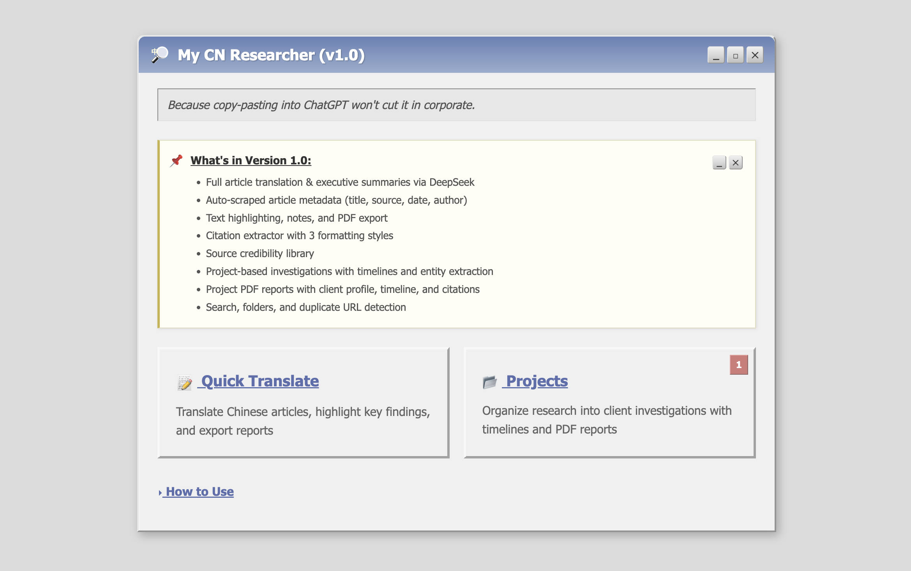

# My CN Researcher (v1.0)

A Chinese media research and translation tool. Translates Chinese articles into English, extracts article metadata, organizes research into projects, and exports PDF reports — all wrapped in a Windows XP retro aesthetic.

  



## Features

### Quick Translate
- Paste a URL or raw Chinese text to translate full articles via DeepSeek
- Auto-scraped metadata: title, source, publication date, author
- AI-generated executive summaries
- Text highlighting with 5 color options
- Notes panel for annotations
- Citation extractor with 3 formatting styles (Inline, Footnote, Short Ref)
- PDF and text export with article title, highlights, and citations

### Projects
- Organize translations into client investigations
- Project profiles with name, client, industry, status, due date, and notes
- Chronological timeline auto-generated from article dates
- Key entity extraction across all project articles (people, companies, orgs, locations, regulations) with frequency counts
- Translate articles directly within a project
- Project PDF export with client profile, timeline, and full article details
- Due date tracking with countdown badges
- Unfiled bucket for saving translations before assigning to a project

### Source Library
- Track media outlets with type and credibility tier
- Auto-match sources to articles by URL domain
- Source credibility badges displayed on article cards and in exports

### Other
- History sidebar with search, folders, and drag-and-drop organization
- Duplicate URL detection
- Dark mode (XP Royale Noir theme)
- Special handling for paywalled/SPA sites (e.g. infzm.com)

## Setup

### Prerequisites
- Python 3.10+
- A [DeepSeek API key](https://platform.deepseek.com/)

### Installation

```bash
git clone https://github.com/cindyfn/china-research-tool.git
cd china-research-tool
pip install -r requirements.txt
```

### Configuration

Create a `.env` file in the project root:

```
DEEPSEEK_API_KEY=your_api_key_here
```

### Run

```bash
python app.py
```

The app runs at `http://localhost:5000`.

## Tech Stack

- **Backend:** Flask, SQLite
- **Translation:** DeepSeek API (deepseek-chat)
- **PDF generation:** FPDF2 with CJK font support (PingFang on macOS)
- **Web scraping:** BeautifulSoup4, requests
- **Frontend:** Vanilla JS, CSS (no frameworks)

## Project Structure

```
china-research-tool/
├── app.py              # Flask backend, all routes, PDF generation
├── templates/
│   └── index.html      # Full UI with JS (single-page app)
├── static/
│   └── style.css       # Windows XP aesthetic + dark mode
├── requirements.txt
├── .env                # API key (not tracked)
└── .gitignore
```

## License

MIT
